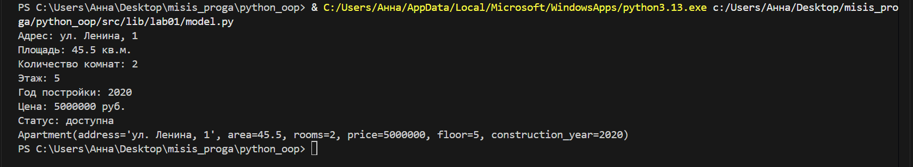
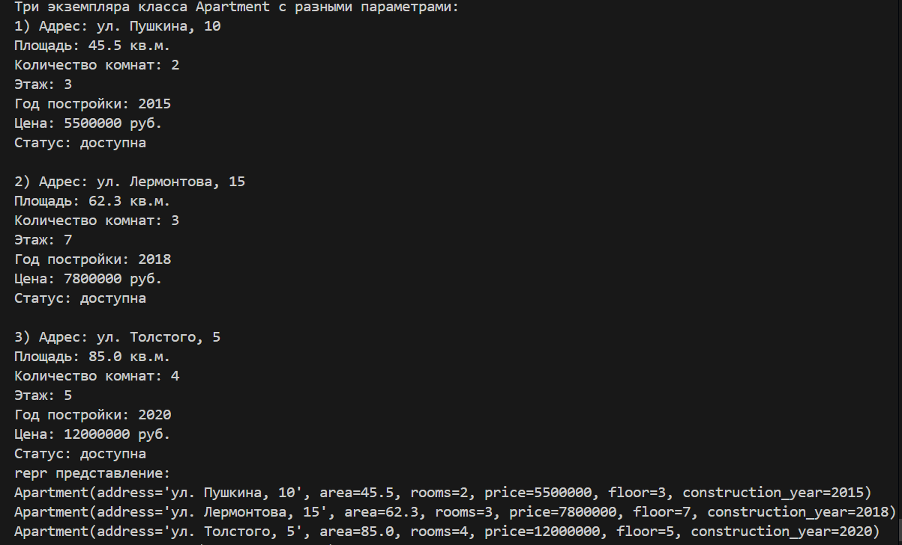
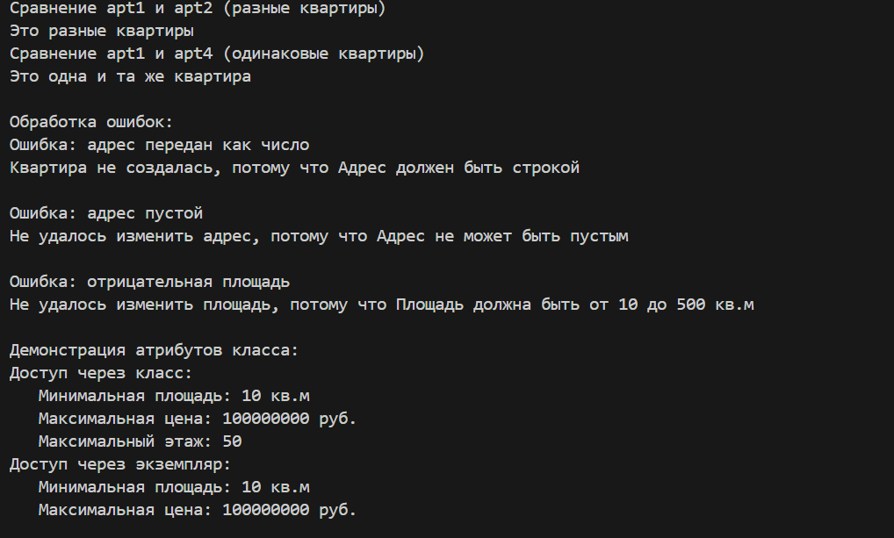
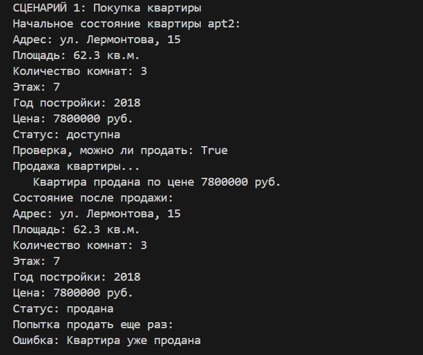
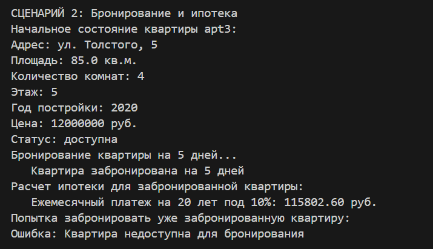
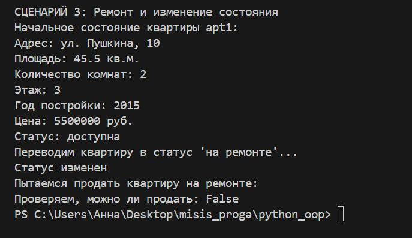

# <h1>ЛР-1 — Класс и инкапсуляция<h1>

# <h4>model.py, demo.py<h4>

### Теоретическая часть

**Свойство** — механизм, позволяющий контролировать доступ к атрибутам через методы.  
**Геттер** — метод для получения значения закрытого атрибута.  
**Сеттер** — метод для установки значения с проверкой.  

**Магические методы:**
- `__init__` — Конструктор
- `__str__` — Для пользователей
- `__repr__` — Для разработчиков
- `__eq__` — Сравнение на равенство

**Валидация** — проверка данных на корректность перед сохранением.

**Основные проверки:**
- `Тип данных:` — isinstance(value, type)
- `Диапазон:` — min <= value <= max
- `Пустая строка:` — len(value.strip()) == 0

### Класс Apartment

# model.py:

```
"""
Модуль содержит класс Apartment для представления квартиры в системе недвижимости.
"""

from datetime import datetime, timedelta

class Apartment:
    # Атрибуты класса:
    min_area = 10  # минимальная площадь
    max_area = 500  # максимальная площадь
    min_rooms = 1  # минимальное количество комнат
    max_rooms = 10  # максимальное количество комнат
    min_price = 100000  # минимальная цена
    max_price = 100000000  # максимальная цена (100 млн)
    min_floor = 1  # минимальный этаж
    max_floor = 50  # максимальный этаж
    
    # Константы состояний
    STATUS_AVAILABLE = "доступна"
    STATUS_RESERVED = "забронирована"
    STATUS_SOLD = "продана"
    STATUS_RENTED = "сдана в аренду"
    STATUS_UNDER_REPAIR = "на ремонте"
    
    def __init__(self, address: str, area: float, rooms: int, price: float, 
                 floor: int = 1, construction_year: int = None):
        # Закрытые атрибуты (с двумя подчеркиваниями)
        self.__address = None
        self.__area = None
        self.__rooms = None
        self.__price = None
        self.__floor = None
        self.__construction_year = None
        self.__status = self.STATUS_AVAILABLE  # состояние квартиры
        self.__reserved_until = None
        self.__rental_contracts = []
        
        # Устанавливаем значения через сеттеры
        self.address = address
        self.area = area
        self.rooms = rooms
        self.price = price
        self.floor = floor
        
        # Обработка года постройки
        if construction_year is None:
            construction_year = datetime.now().year
        self.construction_year = construction_year
    
    #Свойства:
    
    @property
    def address(self):
        return self.__address
    @address.setter
    def address(self, value):
        self.__address = self._validate_address(value, "Адрес")
    
    @property
    def area(self):
        return self.__area
    @area.setter
    def area(self, value):
        self.__area = self._validate_area(value)
    
    @property
    def rooms(self):
        return self.__rooms
    @rooms.setter
    def rooms(self, value):
        self.__rooms = self._validate_rooms(value)
    
    @property
    def price(self):
        return self.__price
    @price.setter
    def price(self, value):
        self.__price = self._validate_price(value)
    
    @property
    def floor(self):
        return self.__floor
    @floor.setter
    def floor(self, value):
        self.__floor = self._validate_floor(value)
    
    @property
    def construction_year(self):
        return self.__construction_year
    @construction_year.setter
    def construction_year(self, value):
        self.__construction_year = self._validate_construction_year(value)
    
    @property
    def status(self):
        # Проверяем, не закончилась ли бронь
        if (self.__status == self.STATUS_RESERVED and 
            self.__reserved_until and 
            datetime.now() > self.__reserved_until):
            self.__status = self.STATUS_AVAILABLE
            self.__reserved_until = None
        return self.__status
    
    @property
    def is_available(self):
        """Доступна ли квартира"""
        return self.__status == self.STATUS_AVAILABLE
    
    #Магические методы:
    
    def __str__(self):
        return (f"Адрес: {self.__address}\n"
                f"Площадь: {self.__area:.1f} кв.м.\n"
                f"Количество комнат: {self.__rooms}\n"
                f"Этаж: {self.__floor}\n"
                f"Год постройки: {self.__construction_year}\n"
                f"Цена: {self.__price:.0f} руб.\n"
                f"Статус: {self.__status}")
    
    def __repr__(self):
        return (f"Apartment(address='{self.__address}', area={self.__area}, "
                f"rooms={self.__rooms}, price={self.__price:.0f}, floor={self.__floor:.0f}, "
                f"construction_year={self.__construction_year})")
    
    def __eq__(self, other):
        """Сравнение квартир"""
        if not isinstance(other, Apartment):
            return False
        return (self.__address == other.__address and 
                self.__area == other.__area and
                self.__rooms == other.__rooms and
                self.__price == other.__price and
                self.__floor == other.__floor and
                self.__construction_year == other.__construction_year)
    
    #Методы валидации:
    
    def _validate_address(self, value, field_name):
        """Проверка адреса"""
        if not isinstance(value, str):
            raise TypeError(f"{field_name} должен быть строкой")
        value = value.strip()
        if len(value) == 0:
            raise ValueError(f"{field_name} не может быть пустым")
        if len(value) < 5:
            raise ValueError(f"{field_name} слишком короткий (минимум 5 символов)")
        return value
    
    def _validate_area(self, area):
        """Проверка площади"""
        if not isinstance(area, (int, float)):
            raise TypeError("Площадь должна быть числом")
        if self.min_area <= area <= self.max_area:
            return float(area)
        raise ValueError(f"Площадь должна быть от {self.min_area} до {self.max_area} кв.м")
    
    def _validate_rooms(self, rooms):
        """Проверка количества комнат"""
        if not isinstance(rooms, int):
            raise TypeError("Количество комнат должно быть целым числом")
        if self.min_rooms <= rooms <= self.max_rooms:
            return rooms
        raise ValueError(f"Количество комнат должно быть от {self.min_rooms} до {self.max_rooms}")
    
    def _validate_price(self, price):
        """Проверка цены"""
        if not isinstance(price, (int, float)):
            raise TypeError("Цена должна быть числом")
        if self.min_price <= price <= self.max_price:
            return float(price)
        raise ValueError(f"Цена должна быть от {self.min_price:.0f} до {self.max_price:.0f} руб.")
    
    def _validate_floor(self, floor):
        """Проверка этажа"""
        if not isinstance(floor, int):
            raise TypeError("Этаж должен быть целым числом")
        if self.min_floor <= floor <= self.max_floor:
            return floor
        raise ValueError(f"Этаж должен быть от {self.min_floor} до {self.max_floor}")
    
    def _validate_construction_year(self, year):
        """Проверка года постройки"""
        if not isinstance(year, int):
            raise TypeError("Год постройки должен быть целым числом")
        current_year = datetime.now().year
        if 1800 <= year <= current_year:
            return year
        raise ValueError(f"Год постройки должен быть от 1800 до {current_year}")
    
    #Бизнес-методы:
    
    def can_be_sold(self):
        """Проверка, можно ли продать квартиру"""
        if self.__status == self.STATUS_SOLD:
            return False
        if self.__status == self.STATUS_RENTED:
            return False
        return True
    
    def sell(self):
        """Продажа квартиры"""
        if self.__status == self.STATUS_SOLD:
            raise ValueError("Квартира уже продана")
        if self.__status == self.STATUS_RENTED:
            raise ValueError("Нельзя продать квартиру, сданную в аренду")
        
        self.__status = self.STATUS_SOLD
        self.__reserved_until = None
        return f"Квартира продана по цене {self.__price:.0f} руб."
    
    def reserve(self, days=7):
        """Бронирование квартиры"""
        if self.__status != self.STATUS_AVAILABLE:
            raise ValueError("Квартира недоступна для бронирования")
        
        self.__status = self.STATUS_RESERVED
        self.__reserved_until = datetime.now() + timedelta(days=days)
        return f"Квартира забронирована на {days} дней"
    
    def set_unavailable(self):
        """Перевод в статус 'на ремонте'"""
        self.__status = self.STATUS_UNDER_REPAIR
        self.__reserved_until = None
    
    def calculate_monthly_payment(self, years, percent):
        """Расчет ипотеки"""
        if self.__status == self.STATUS_SOLD:
            raise ValueError("Квартира уже продана")
        
        months = years * 12
        monthly_rate = percent / 100 / 12
        
        if monthly_rate == 0:
            return self.__price / months
        
        payment = self.__price * monthly_rate * (1 + monthly_rate)**months / ((1 + monthly_rate)**months - 1)
        return round(payment, 2)


if __name__ == "__main__":
    # Простая проверка работы класса
    apt = Apartment("ул. Ленина, 1", 45.5, 2, 5000000, 5, 2020)
    print(apt)
    print(repr(apt))
```



# demo.py:

```
from model import Apartment

# Создаем несколько квартир
apt1 = Apartment("ул. Пушкина, 10", 45.5, 2, 5500000, 3, 2015)
apt2 = Apartment("ул. Лермонтова, 15", 62.3, 3, 7800000, 7, 2018)
apt3 = Apartment("ул. Толстого, 5", 85.0, 4, 12000000, 5, 2020)
apt4 = Apartment("ул. Пушкина, 10", 45.5, 2, 5500000, 3, 2015)  #копия apt1
print("Три экземпляра класса Apartment с разными параметрами:")
print(f"1) {apt1}")  # вызывает __str__
print()
print(f"2) {apt2}")
print()
print(f"3) {apt3}")
print("repr представление:")
print(repr(apt1))
print(repr(apt2))
print(repr(apt3))  # вызывает __repr__

print("Сравнение apt1 и apt2 (разные квартиры)")
if apt1 == apt2:  # вызывает __eq__
    print("Это одна и та же квартира")
else:
    print("Это разные квартиры")

print("Сравнение apt1 и apt4 (одинаковые квартиры)")
if apt1 == apt4:  # вызывает __eq__
    print("Это одна и та же квартира")
else:
    print("Это разные квартиры")
print()
print("Обработка ошибок:")

print('Ошибка: адрес передан как число')
try:
    apt5 = Apartment(123, 45.5, 2, 5500000, 3, 2015)
except (ValueError, TypeError) as e:
    print(f"Квартира не создалась, потому что {e}\n")

print('Ошибка: адрес пустой')
try:
    apt1.address = ""  # пробуем изменить адрес
except (ValueError, TypeError) as e:
    print(f"Не удалось изменить адрес, потому что {e}\n")

print('Ошибка: отрицательная площадь')
try:
    apt1.area = -10
except (ValueError, TypeError) as e:
    print(f"Не удалось изменить площадь, потому что {e}\n")

print("Демонстрация атрибутов класса:")

print(f"Доступ через класс:")
print(f"   Минимальная площадь: {Apartment.min_area} кв.м")
print(f"   Максимальная цена: {Apartment.max_price:.0f} руб.")
print(f"   Максимальный этаж: {Apartment.max_floor}")

print(f"Доступ через экземпляр:")
print(f"   Минимальная площадь: {apt1.min_area} кв.м")
print(f"   Максимальная цена: {apt1.max_price:.0f} руб.")
print()
print("СЦЕНАРИЙ 1: Покупка квартиры")

print(f"Начальное состояние квартиры apt2:")
print(apt2)

print(f"Проверка, можно ли продать: {apt2.can_be_sold()}")
print(f"Продажа квартиры...")
result = apt2.sell()
print(f"   {result}")
print(f"Состояние после продажи:")
print(apt2)

print(f"Попытка продать еще раз:")
try:
    apt2.sell()
except ValueError as e:
    print(f"Ошибка: {e}")

print()
print("СЦЕНАРИЙ 2: Бронирование и ипотека")

print(f"Начальное состояние квартиры apt3:")
print(apt3)

print(f"Бронирование квартиры на 5 дней...")
result = apt3.reserve(5)
print(f"   {result}")

print(f"Расчет ипотеки для забронированной квартиры:")
payment = apt3.calculate_monthly_payment(20, 10)
print(f"   Ежемесячный платеж на 20 лет под 10%: {payment:.2f} руб.")

print(f"Попытка забронировать уже забронированную квартиру:")
try:
    apt3.reserve(3)
except ValueError as e:
    print(f"Ошибка: {e}")
print()
print("СЦЕНАРИЙ 3: Ремонт и изменение состояния")

print(f"Начальное состояние квартиры apt1:")
print(apt1)

print(f"Переводим квартиру в статус 'на ремонте'...")
apt1.set_unavailable()
print(f"Статус изменен")

print(f"Пытаемся продать квартиру на ремонте:")
try:
    apt1.sell()
except ValueError as e:
    print(f"Ошибка: {e}")

print(f"Проверяем, можно ли продать: {apt1.can_be_sold()}")
```










