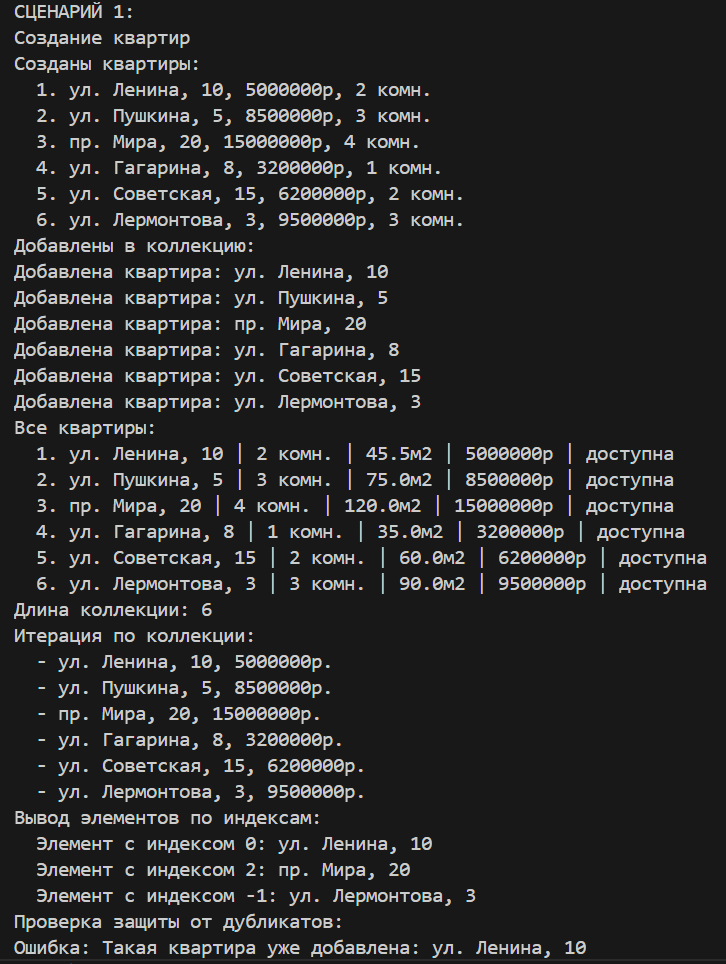
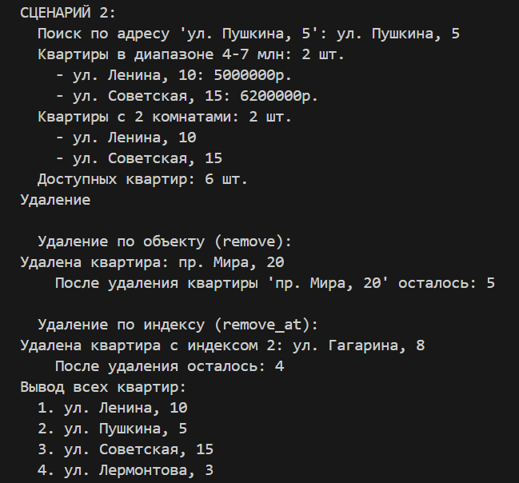
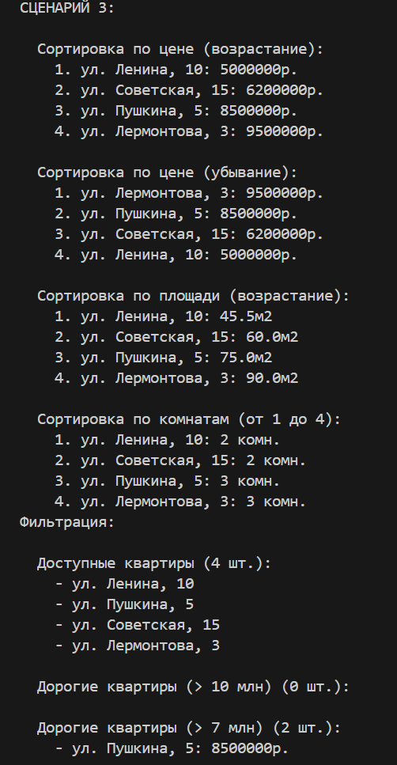
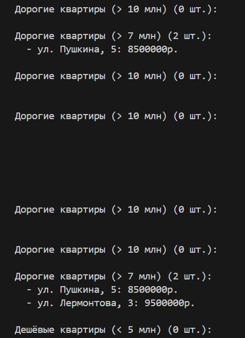

# <h1>Лабораторная работа №2(Коллекции)<h1>

# Вариант №9(Недвижимость)

# Цели работы:

- Научиться работать с коллекциями объектов  
- Реализовать собственный контейнерный класс  
- Освоить итерацию, индексацию, сортировку и фильтрацию коллекции  

# Возможности коллекции Apartment_collection:
- Добавляет новые квартиры в коллекцию  
- Удаляет квартиры из коллекции  
- Ищет квартиры по различным критериям  
- Сортирует квартиры по разным параметрам  
- Получает подмножества квартир (например, только доступные)  

# Методы
- `add(item)` — Добавляет квартиру в коллекцию. Проверяет тип и отсутствие дубликата (по __eq__)  
- `remove(item)` — 	Удаляет квартиру из коллекции  
- `remove_at(index)` — Удаляет квартиру по индексу  
- `get_all` — Возвращает копию списка всех квартир  
- `find_by_address(address)` — Находит квартиру по точному адресу  
- `find_by_price_range(min_price, max_price)` — Находит квартиры в ценовом диапазоне  
- `find_by_rooms(rooms)` — Находит квартиры с указанным количеством комнат  
- `find_available()` — Находит все доступные квартиры  
- `__len__()` — Возвращает количество квартир в коллекции    
- `__iter__()` — Возвращает итератор по списку квартир   
- `__getitem__(index)` — Обеспечивает доступ по индексу  
- `sort_by_price(reverse=False)` — Сортирует по цене (возрастание/убывание)  
- `sort_by_area(reverse=False)` — Сортирует по площади (возрастание/убывание)  
- `sort_by_rooms(reverse=False)` — Сортирует по количеству комнат (возрастание/убывание)  
- `get_available()` — Возвращает новую коллекцию только с доступными квартирами  
- `get_expensive(threshold=10000000)` — Возвращает коллекцию квартир дороже указанного порога  
- `get_cheap(threshold=5000000)` — Возвращает коллекцию квартир дешевле указанного порога  

### Демонстрация работы(demo.py):

# Сценарий 1 - Базовая работа с коллекцией

- Создание объектов Apartment с разными характеристиками

- Добавление всех квартир в коллекцию через метод add()

- Вывод всех квартир с использованием get_all() и нумерации

- Получение длины коллекции через len(collection)

- Итерация по коллекции с помощью цикла for

- Доступ к элементам по индексу: collection[0], collection[2], collection[-1]

Проверки:

- Защита от дубликатов — попытка добавить квартиру с теми же параметрами вызывает ValueError

- Проверка типа — попытка добавить строку вместо квартиры вызывает TypeError

# Сценарий 2 - Поиск и удаление

- Поиск квартиры по адресу через find_by_address()

- Поиск квартир в ценовом диапазоне 4-7 млн через find_by_price_range()

- Поиск квартир с 2 комнатами через find_by_rooms()

- Поиск доступных квартир через find_available()

- Удаление квартиры по объекту через remove()

- Удаление квартиры по индексу через remove_at()

- Проверка get_all() после удалений

# Сценарий 3 - Сортировка и фильтрация

- Сортировка по цене (возрастание) через sort_by_price()

- Сортировка по цене (убывание) через sort_by_price(reverse=True)

- Сортировка по площади через sort_by_area()

- Сортировка по количеству комнат через sort_by_rooms()

- Фильтрация доступных квартир через get_available()

- Фильтрация дорогих квартир (>10 млн) через get_expensive()

- Фильтрация дорогих квартир с порогом 7 млн

- Фильтрация дешёвых квартир (<5 млн) через get_cheap()

