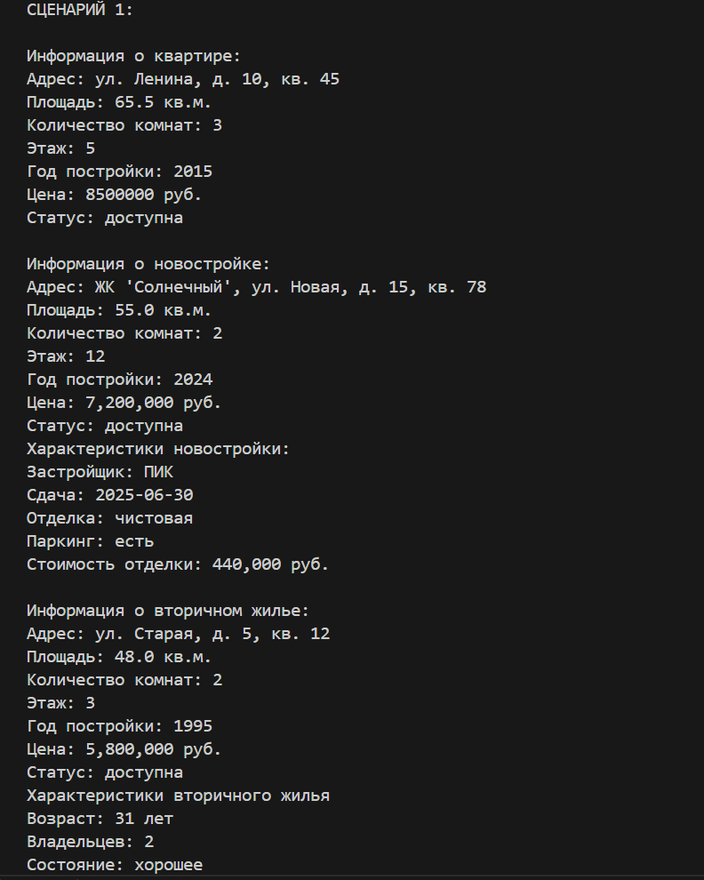
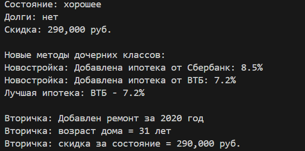
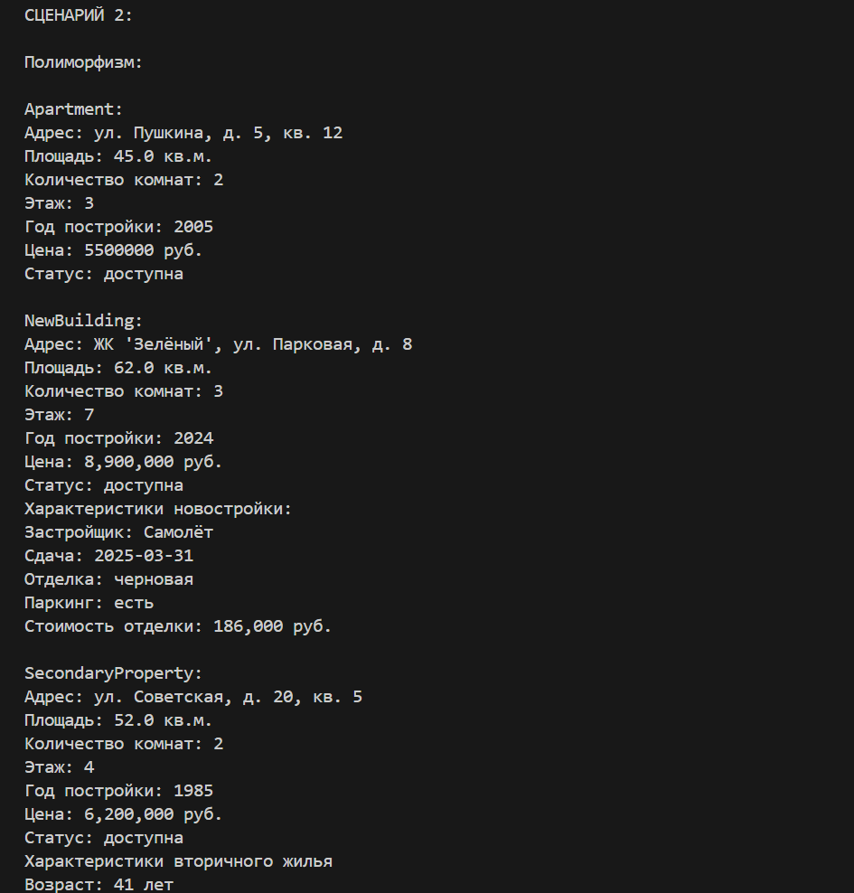
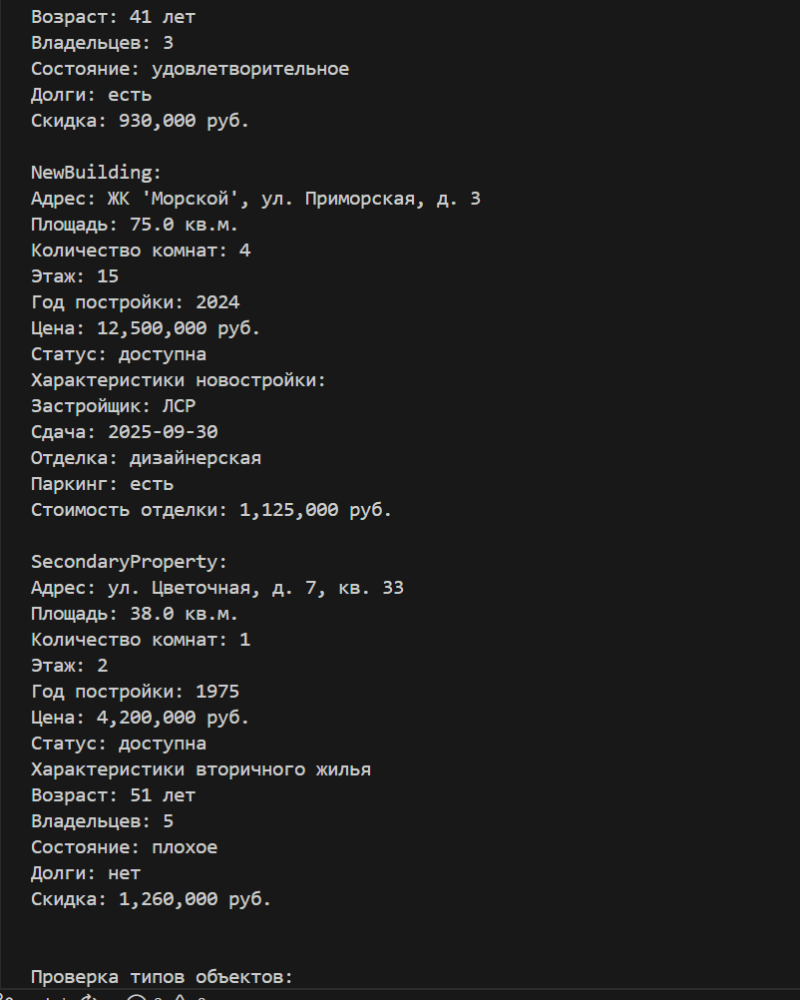
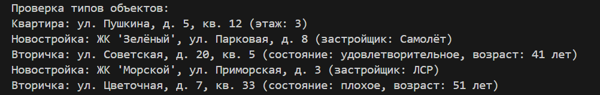
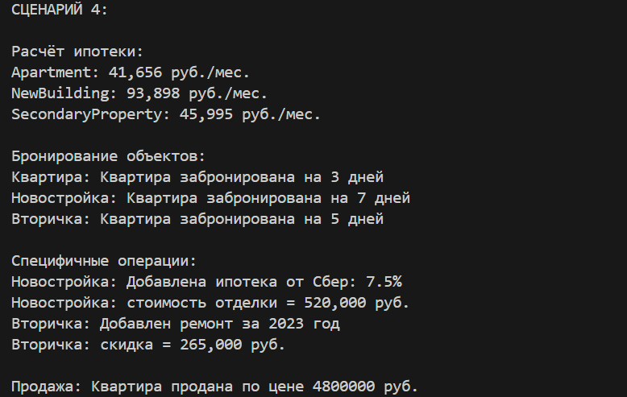
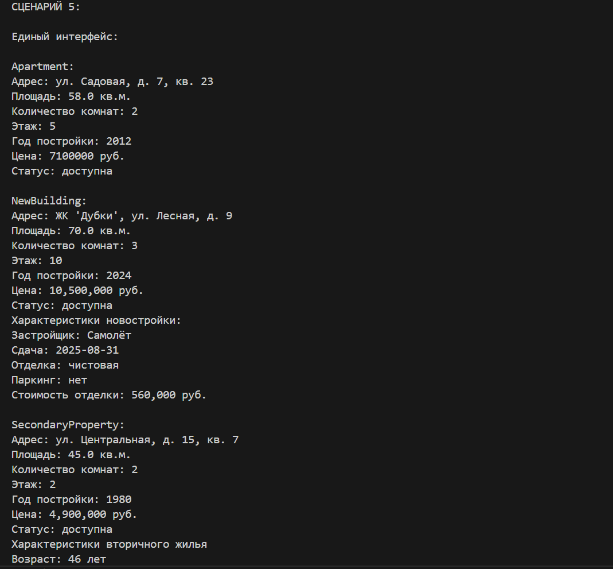
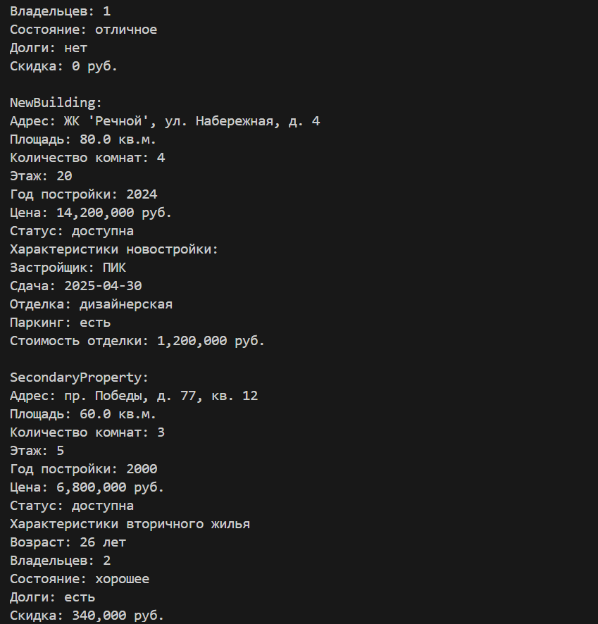
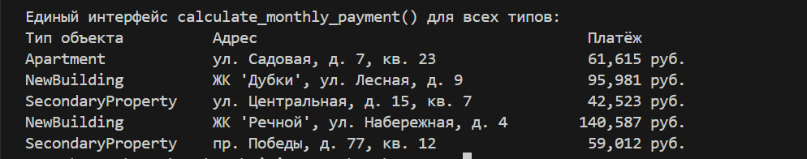

# <h1>Лабораторная работа №3(Наследование и иерархия классов)<h1>

# Вариант №9(Недвижимость)

# Цели работы:

- Освоить механизм наследования классов. 
- Научиться строить иерархию объектов.  
- Понять разницу между:  
      - базовым классом  
      - производным классом  
- Научиться переиспользовать код.  
- Освоить переопределение методов.  

# Родительский класс Apartment:
Родительский класс представляет общую модель объекта недвижимости — квартиры.

# Основные методы
- `__str__()` — Строковое представление объекта  
- `__repr__()` — 	Формальное представление для отладки  
- `__eq__()` — Сравнение двух объектов  
- `reserve(days)` — Бронирование объекта на указанное количество дней  
- `sell()` — Продажа объекта    
- `set_unavailable()` — Перевод в статус "на ремонте" диапазоне  
- `calculate_monthly_payment(years, percent)` — Расчёт ежемесячного платежа по ипотеке  

# Дочерний класс NewBuilding:
Класс представляет квартиру в новостройке. Наследует все характеристики родительского класса и добавляет новые атрибуты и методы.

# Основные методы
- `add_mortgage_program(bank, rate, min_down_payment)` — Добавление ипотечной программы от банка    
- `get_best_mortgage()` — Поиск программы с минимальной процентной ставкой  
- `calculate_finishing_cost()` — Расчёт стоимости отделки (площадь * цена за кв.м)  

# Дочерний класс SecondaryProperty:
Класс представляет квартиру на вторичном рынке. Наследует все характеристики родительского класса и добавляет новые методы и атрибуты.  

# Основные методы
- `add_renovation(year, description, cost)` — Добавление информации о проведённом ремонте  
- `calculate_discount()` — Расчёт скидки в зависимости от состояния квартиры  
- `get_age()` — Расчёт возраста объекта (текущий год - год постройки)   

### Демонстрация работы(demo.py):

# Сценарий 1 - Базовое наследование

- Создание объекта для каждого дочернего класса  

- Демонстрация работы новых методов  

# Сценарий 2 - Полиморфизм и проверка типов  

- Создаёт список из 5 объектов разных типов  

- Для каждого объекта разный вывод(полиморфизм)  

- Проверка типов через isinstance()

# Сценарий 3 - Коллекция и фильтрация

- Создаёт коллекцию из 6 объектов  

- Выводит общее количество и список объектов  

- Фильтрация  

- Считает общую стоимость  

# Сценарий 4 - Бизнес-методы  

- Создаёт 3 объекта  

- Расчитывает ипотеку для каждого объекта  

- Бронирует объекты  
 
- Показывает специфичные методы  

- Продажа квартиры  

# Сценарий 5 - Единый интерфейс  

- Создаёт 5 объектов разных типов  

- Вызов calculate_monthly_payment()

# Вывод  

В ходе выполнения лабораторной работы были изучены:  

- Наследование  

- Полиморфизм  