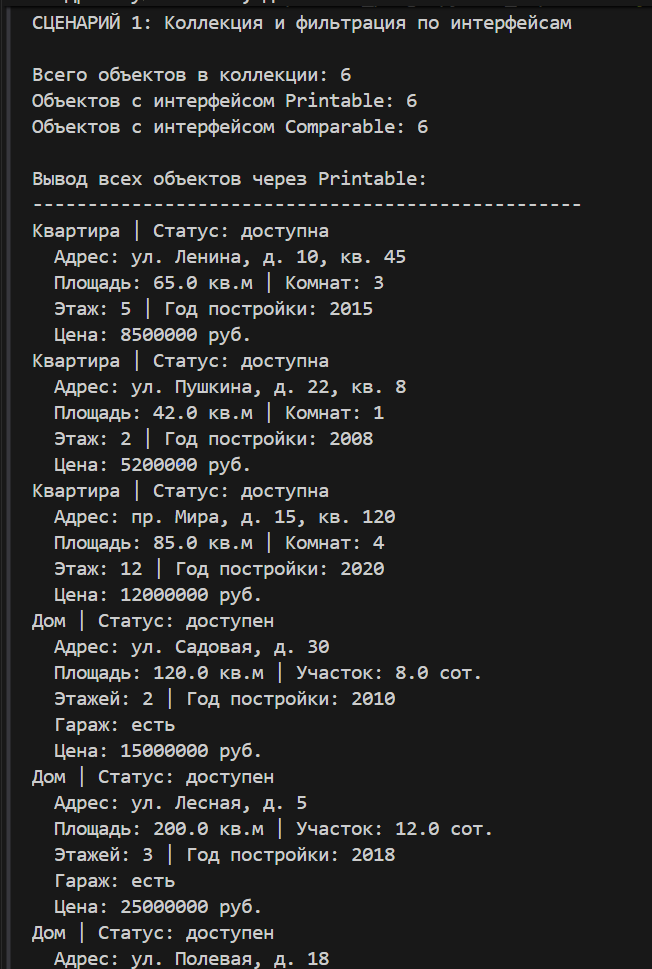
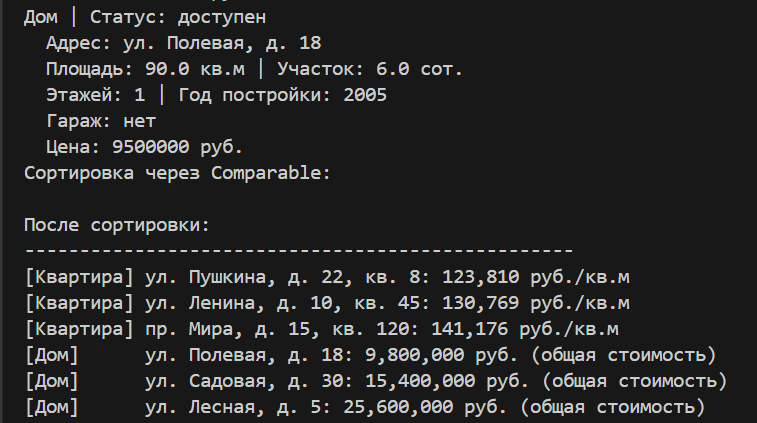
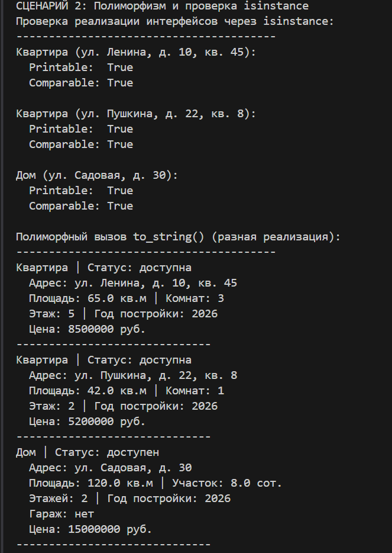
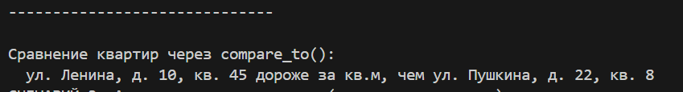
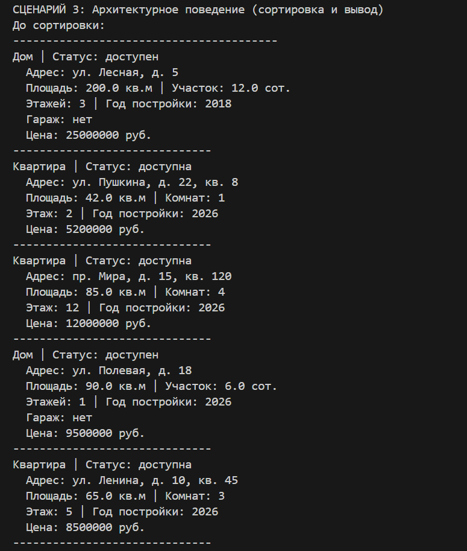
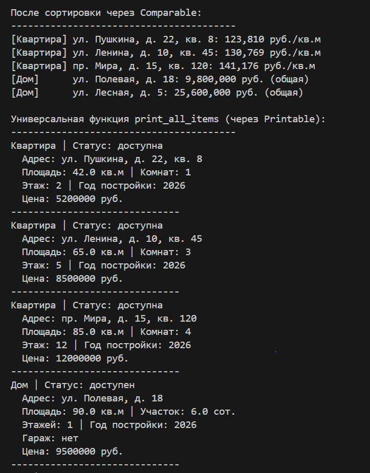
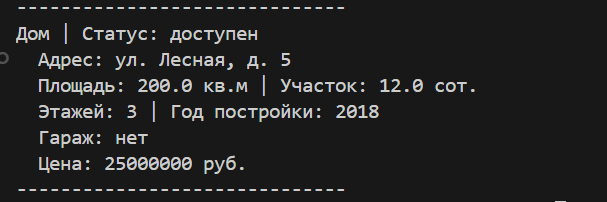

# <h1>Лабораторная работа №4(Интерфейсы и абстрактные классы (ABC))<h1>

# Вариант №9(Недвижимость)

# Цели работы:

- Познакомиться с абстрактными базовыми классами (ABC).   
- Освоить понятие интерфейса (контракта поведения).  
- Научиться задавать обязательные методы для классов.  
- Закрепить полиморфизм через единый интерфейс.  
- Научиться проектировать архитектуру, а не просто классы.

# Описание интерфейсов:

# 1. Printable (вывод информации)

Гарантирует, что объект можно представить в виде форматированной строки.

`to_string()` - Возвращает строковое представление объекта `str`

# 2. Comparable (сравнение объектов)

Гарантирует, что объекты одного типа можно сравнивать между собой.

`compare_to(other)` - Сравнивает текущий объект с другим  

# Используемые классы:
- `Класс Apartment`    
- `Класс House`    

`to_string()` - Показывает квартиру: площадь, комнаты, этаж. Показывает дом: площадь, участок, этажность, гараж

`compare_to()` - Сравнение по цене за кв.м. Сравнение по общей стоимости (дом + участок)

### Демонстрация работы(demo.py):
# Сценарий 1 - Коллекция и фильтрация по интерфейсам

Создаётся коллекция из 6 объектов (3 квартиры + 3 дома). Демонстрируется:

- Добавление объектов разных типов в единую коллекцию  
- Фильтрация коллекции по интерфейсам (`get_printable()`, `get_comparable()`)  
- Вывод всех объектов через `Printable` 
- Сортировка коллекции через `Comparable` 

# Сценарий 2 - Полиморфизм и проверка isinstance   

- Проверка реализации интерфейсов через `isinstance()` — все объекты реализуют оба интерфейса  
- Полиморфный вызов `to_string()` — каждый объект выводит информацию в своём формате  
- Сравнение квартир через `compare_to()` — определяется, какая квартира дороже за квадратный метр  

# Сценарий 3 - Архитектурное поведение

- Вывод объектов до сортировки  
- Сортировка через интерфейс `Comparable` — полиморфизм, объекты разных типов сортируются  
- Универсальная функция `print_all_items()`, работающая через интерфейс `Printable`  

# Вывод  

В ходе выполнения лабораторной работы:  

1. Существующие классы расширены для реализации интерфейсов
2. Методы интерфейсов имеют разную реализацию в разных классах (полиморфизм)
3. Коллекция интегрирована с интерфейсами: умеет фильтровать и сортировать объекты