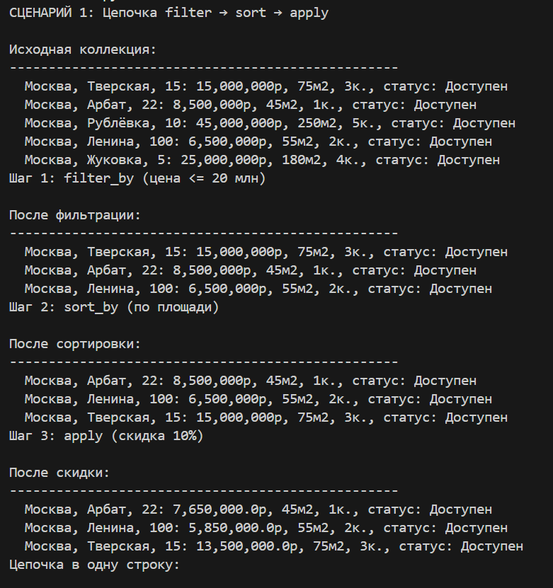
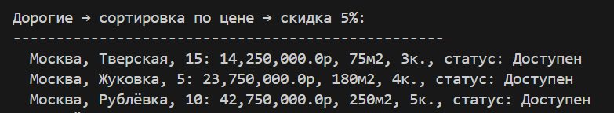
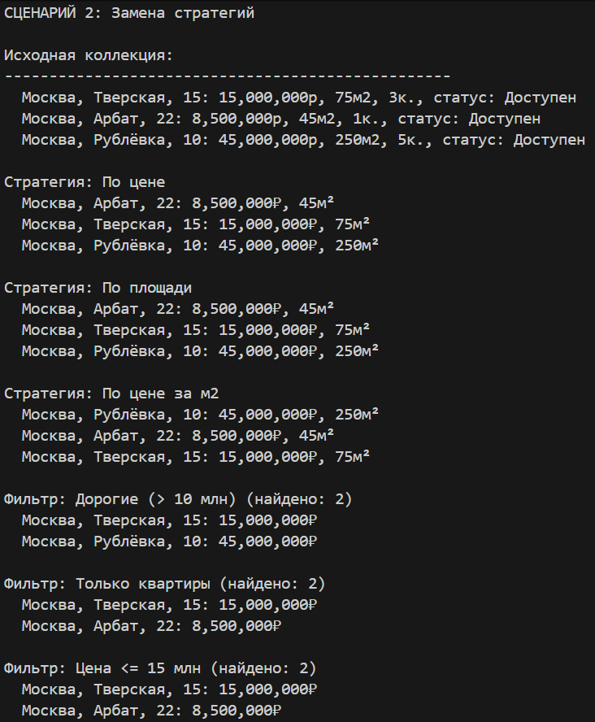
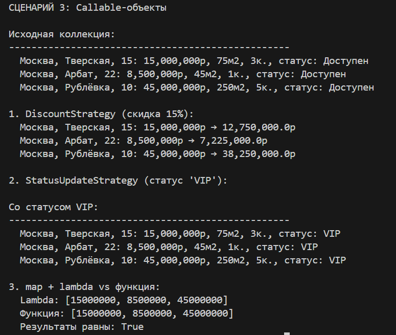

# <h1>Лабораторная работа №5(Функции как аргументы. Стратегии и делегаты.)<h1>

# Вариант №9(Недвижимость)

# Цели работы:

- Освоить передачу функций как аргументов в другие функции и методы.     
- Научиться применять встроенные функции высшего порядка: map, filter, sorted  
- Понять концепцию паттерна «Стратегия» и реализовать его на Python.  
- Освоить lambda-выражения и их практическое применение.  
- Интегрировать функциональный стиль с объектно-ориентированным кодом из предыдущих ЛР.

## 2. Реализованные функции и стратегии

### Стратегии сортировки  
- `by_price` — по цене  
- `by_area` — по площади  
- `by_price_per_square_meter` — по цене за м2  

### Функции-фильтры 
- `is_expensive` — цена > 10 млн  
- `is_apartment` — проверка типа (isinstance)  

### Фабрика функций 
- `make_price_filter(max_price)` — создаёт фильтр по максимальной цене

### Callable-объекты 
- `DiscountStrategy` — применение скидки  
- `StatusUpdateStrategy` — обновление статуса  

### Методы коллекции
- `sort_by(key_func)` — сортировка  
- `filter_by(predicate)` — фильтрация  
- `apply(func)` — применение функции ко всем элементам  

## 3. Демонстрация работы(demo.py):  

### Сценарий 1: Цепочка filter → sort → apply
Создание коллекции → фильтрация по цене → сортировка по площади → применение скидки. Демонстрация цепочки в одну строку.

### Сценарий 2: Замена стратегий
Одна коллекция сортируется тремя разными стратегиями. Применяются три разных фильтра без изменения кода коллекции.

### Сценарий 3: Callable-объекты
Демонстрация DiscountStrategy и StatusUpdateStrategy как callable-объектов. Сравнение lambda и именованной функции через map.

## 4. Вывод

Изучены: передача функций как аргументов, lambda-выражения, map/filter/sorted, паттерн «Стратегия» через callable-объекты.