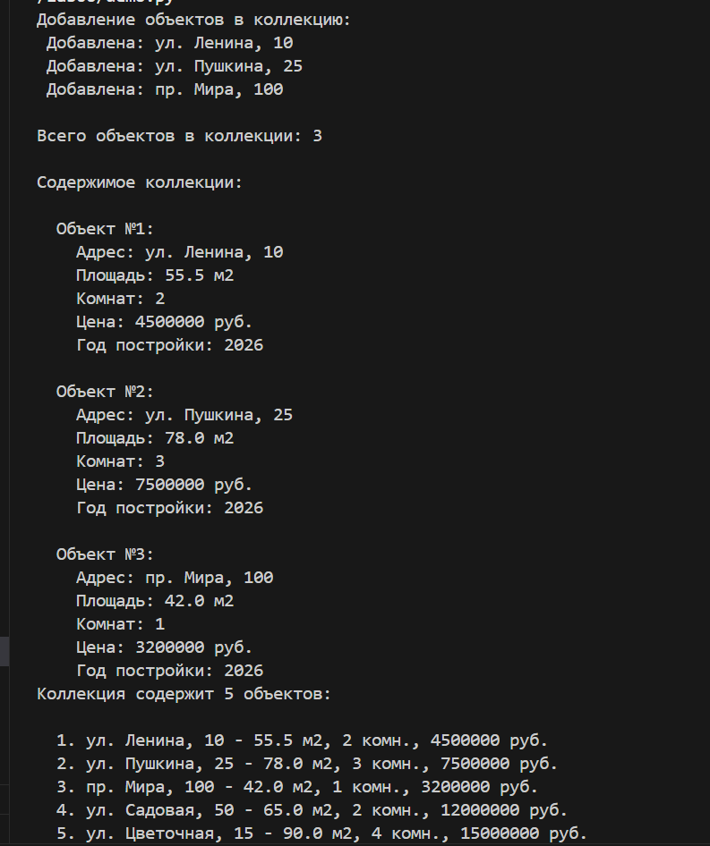
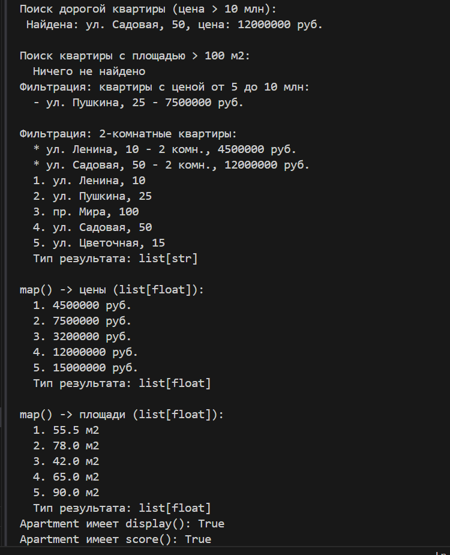
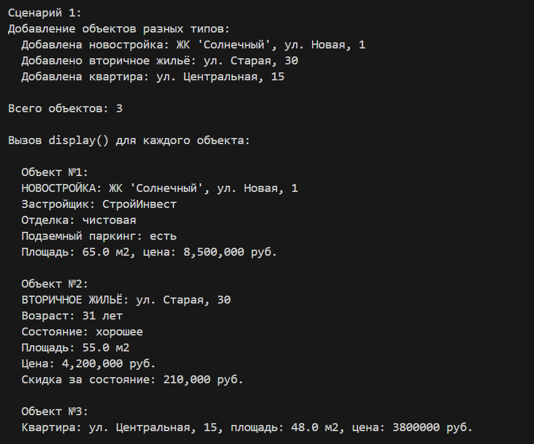
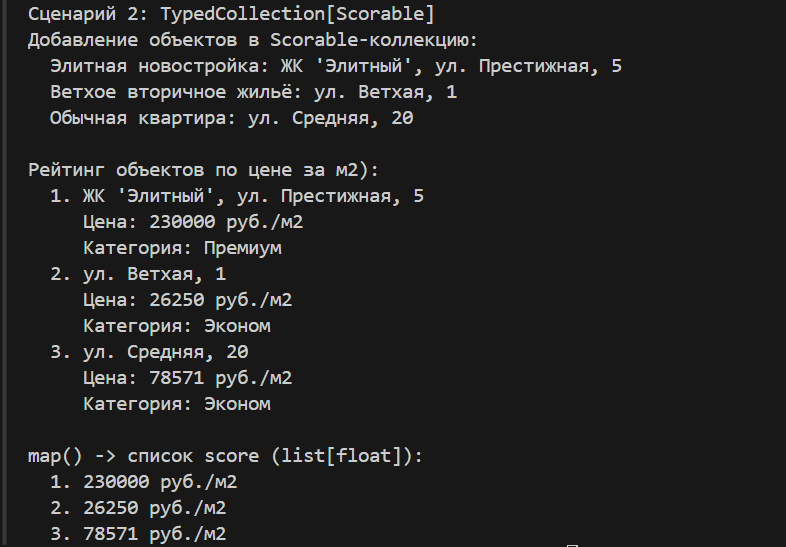

# <h1>Лабораторная работа №6(Generics и typing)<h1>

# Вариант №9(Недвижимость)

# Цели работы:

- Освоить систему аннотаций типов в Python (typing).   
- Научиться создавать обобщённые (generic) классы с помощью TypeVar и Generic.   
-  Понять концепцию структурной типизации через typing.Protocol.  

# Описание Generic-контейнера и typing:
В лабораторной работе реализована система типизированных коллекций для объектов недвижимости.

Использованы:

- TypeVar  
- Generic  
- Protocol  
- Аннотации типов  
- Функции find, filter, map  

# Назначение
Типизированная коллекция позволяет:

- хранить объекты определенного типа  
- безопасно работать с объектами
- использовать подсказки IDE  
- применять функции к коллекции  
- фильтровать и искать объекты  
- использовать структурную типизацию через Protocol  

# Для чего нужен T
T обозначает тип объекта внутри коллекции. 
Например: TypedCollection[Apartment] означает: внутри могут храниться только Apartment

# Для чего нужен R
R используется в map(). Позволяет менять тип результата. Например: list[str]list[float]

# Методы display() и score()
- display()  
Возвращает красивое описание объекта.
Пример: Квартира: Арбат 15, 2 комнаты

- score()  
Возвращает числовую оценку объекта.
Например: цена за квадратный метр

### Демонстрация работы(demo.py):
# Типизированная коллекция
- Добавление объектов в коллекцию  
- Получение количества элементов  
- Вывод содержимого  

# Методы find, filter, map
- fing() - поиск объекта  
- filter() — фильтрация по условию  
- map → list[str] получаем адреса объектов.  
- map → list[float] получаем цены объектов.  
- map → list[float] получаем площади объектов.

# Сценарий 1 - Протоколы Displayable

- Создаётся коллекция с ограничением по протоколу Displayable  
- Добавляются объекты трёх разных типов: NewBuilding, SecondaryProperty, Apartment
- Для каждого объекта вызывается display() — вывод зависит от конкретного класса    

# Сценарий 2 - Scorable   

- Создаётся коллекция с ограничением по протоколу Scorable    
- Добавляются объекты тех же трёх типов  
- Для каждого объекта разный вывод(полиморфизм)  
- Для каждого объекта вызывается score() — вычисляется цена за м2  
- Объекты классифицируются по категориям: Эконом, Комфорт, Премиум  
- Демонстрируется map() для получения списка score  

# Вывод  

В ходе выполнения лабораторной работы были изучены:  

- аннотации типов и их роль  
- Generic и TypeVar  
- Protocol как структурный интерфейс  
- как типизация помогает читать и поддерживать код  