# <h1>Лабораторная работа №7(Консольное приложение)<h1>

# Вариант №9(Недвижимость)

# Цели работы:

- Объединить все знания, полученные в ЛР1–ЛР6, в единое работающее приложение.    
- Реализовать интерактивный CLI-интерфейс с меню и вводом пользователя.  

Пункты меню:

  УПРАВЛЕНИЕ НЕДВИЖИМОСТЬЮ
1. Добавить объект
2. Показать все объекты
3. Найти по адресу
4. Фильтровать
5. Удалить объект
6. Сортировать
7. Статистика
0. Выход  
Выберите пункт: 

Обработка ошибок:
### Обработка ошибок ввода:

- **Неверный пункт меню** — сообщение об ошибке
- **Буквы вместо чисел** — повторный запрос ввода
- **Неверный индекс при удалении** — исключение `ItemNotFoundError`
- **Дубликат адреса** — исключение `DuplicateItemError`
- **Неверные параметры**

### Демонстрация работы(main.py):

# Запуск меню

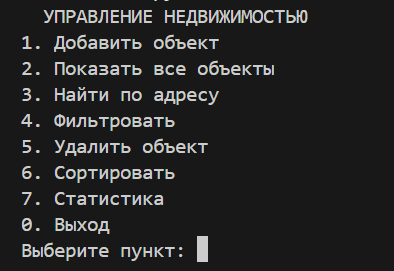

# 1 пункт

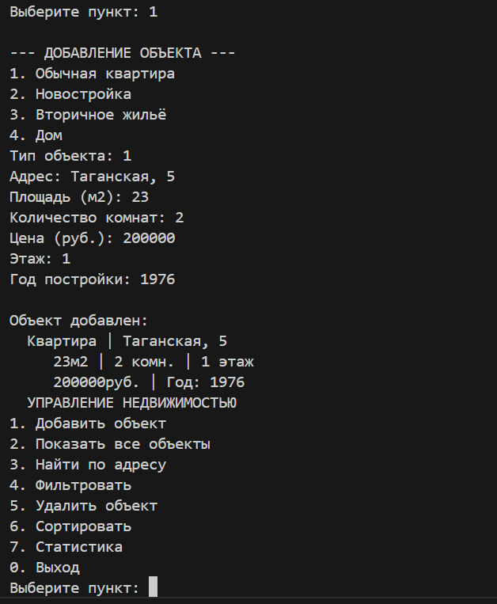

# 2 пункт   

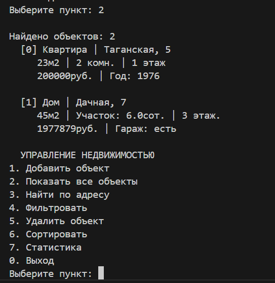

# 3 пункт  

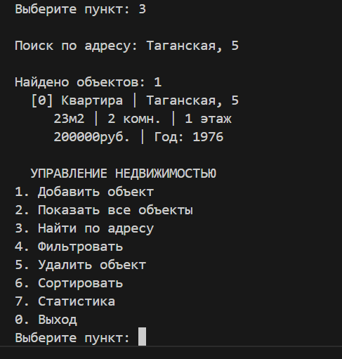

# 4 пункт  

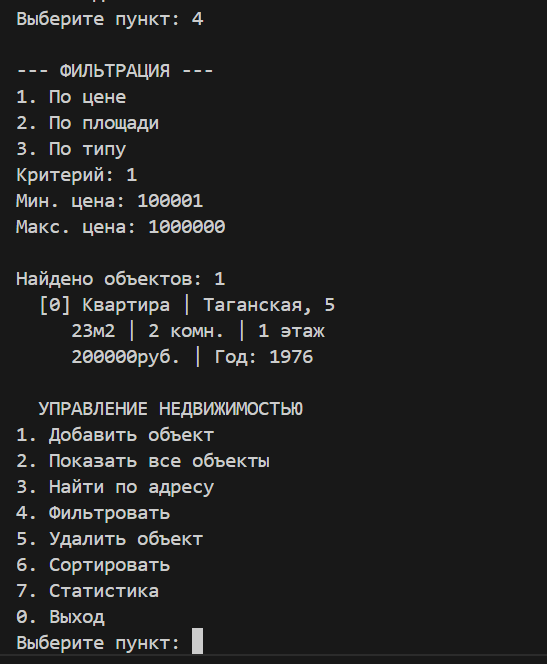

# 5 пункт  

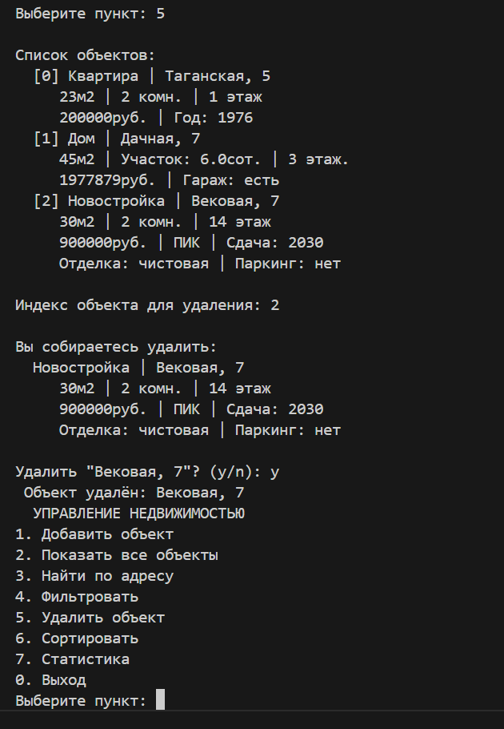

# 6 пункт  

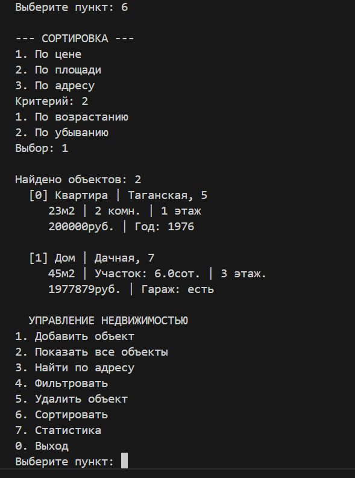

# 7 пункт  

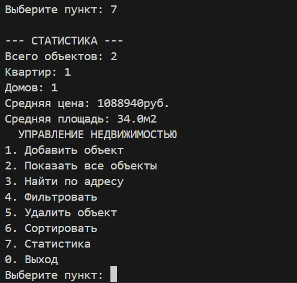

# Обработка ошибок

# Дубликат квартиры

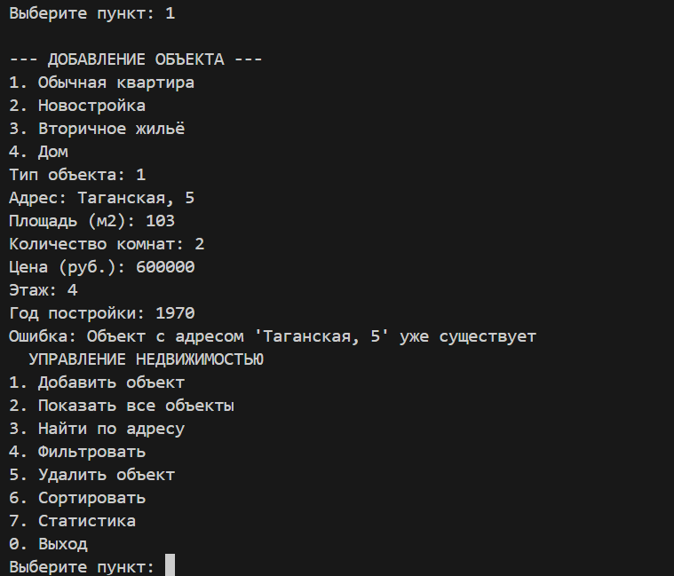

# Несуществующий пункт меню

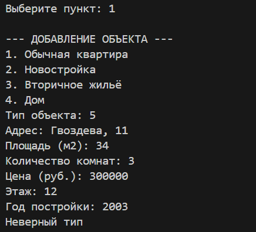

# Цена не в диапазоне

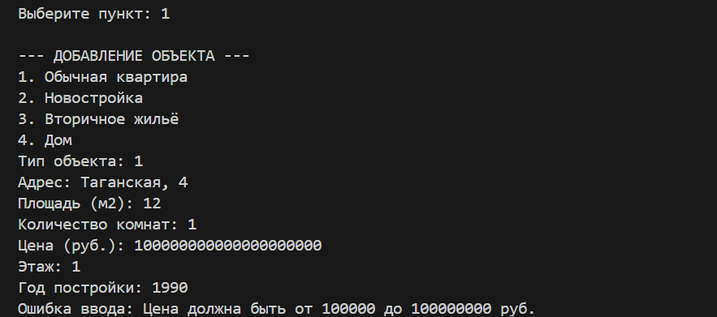

# Буква или нецелое число при вводе номера меню

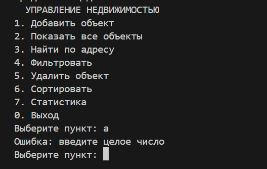

# Отрицательный этаж

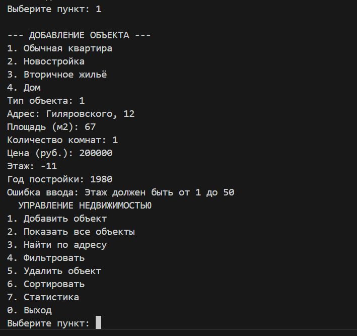

# Отрицательное количество комнат

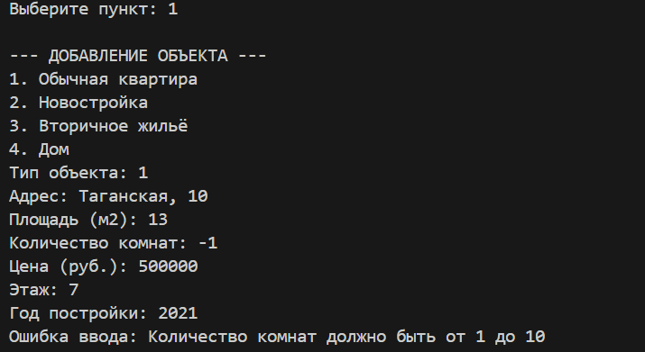

# Год постройки > 2026

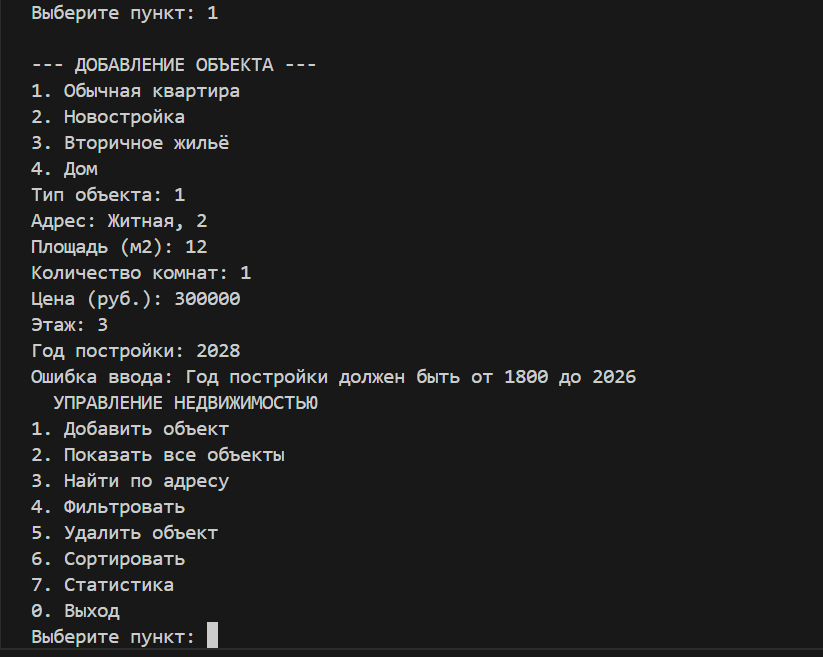

# Вывод  

В ходе выполнения лабораторной работы были изучены:  

- разбиение на модули и слои    
- CLI-интерфейс   
- обработка исключений    
- работа с файлами и типизация   